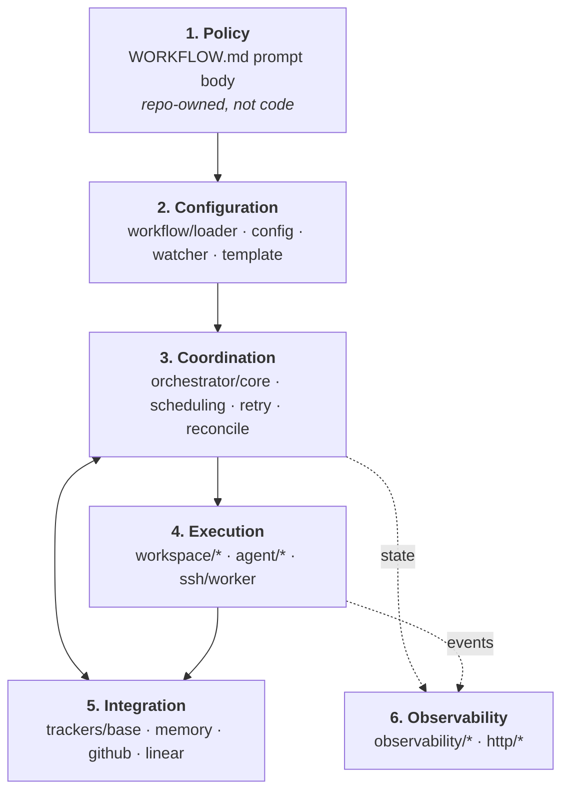
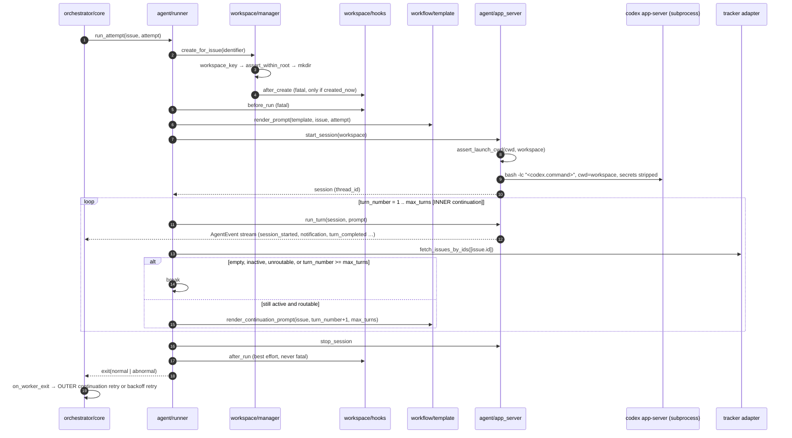

# Architecture

How this implementation is laid out, and how a request actually moves through it.

The organizing map is [SPEC 3.2](../SPEC.md), which names six abstraction levels
and says Symphony "is easiest to port when kept in these layers." So that is the
map used here: a reader who knows the spec should be able to find the code by
layer name. Module ownership is in [`CONTRACTS.md`](../CONTRACTS.md); this
document explains how the owned pieces fit together.

> [!NOTE]
> **Verification status.** This repository is being built by many agents in
> parallel. Every claim below is tagged:
>
> | Tag | Meaning |
> |---|---|
> | **[verified]** | Read against source on disk at the snapshot below. |
> | **[design]** | The module does not exist on disk yet. The behavior described is the contract it is being written against ([`CONTRACTS.md`](../CONTRACTS.md) §3 + the cited SPEC section), not observed behavior. |
>
> Snapshot: working tree of `D:\symphony-python`, 2026-07-28, with
> `pytest` reporting **260 passed** across `test_retry.py`, `test_scheduling.py`,
> `test_template.py`, `test_watcher.py`, `test_workflow_loader.py`, and
> `test_workspace.py`. Per-requirement status is tracked in
> [`CONFORMANCE.md`](CONFORMANCE.md).

---

## 1. Layer map



| # | SPEC 3.2 layer | Modules | Spec sections |
|---|---|---|---|
| 1 | Policy (repo-defined) | `WORKFLOW.md` prompt body; team rules | 5.4, 12 |
| 2 | Configuration (typed getters) | `workflow/loader.py`, `workflow/config.py`, `workflow/watcher.py`, `workflow/template.py` | 5, 6, 12 |
| 3 | Coordination (orchestrator) | `orchestrator/core.py`, `scheduling.py`, `retry.py`, `reconcile.py` | 7, 8, 16 |
| 4 | Execution (workspace + agent subprocess) | `workspace/{manager,safety,hooks}.py`, `agent/{runner,app_server,events,approvals}.py`, `ssh/worker.py` | 9, 10, 16.5, App. A |
| 5 | Integration (tracker adapter) | `trackers/base.py`, `trackers/{memory,github,linear}.py` | 11 |
| 6 | Observability (logs + status) | `observability/{logging,snapshot,status,humanize}.py`, `http/{server,api,dashboard}.py` | 13 |

Two things sit outside the six-layer map and are called out here rather than
forced into it:

- **`models.py` and `errors.py`** are the shared vocabulary every layer imports.
  They are not a layer; they are the type system the layers agree on. **[verified]**
- **`rlm/`** is an addressability surface over the running system, not a layer in
  the data path. It is this implementation's extension, documented in
  [`RLM.md`](RLM.md) (owned by another author). **[design]**

### 1.1 Policy layer

`WORKFLOW.md` is repository-owned and version-controlled (SPEC 5.1). Its
Markdown body is the per-issue prompt template; its YAML front matter is
everything else. There is no service-side config file — SPEC 5.2's design note
requires the workflow file be self-contained enough to describe and run a
workflow without out-of-band configuration.

The example at the repository root is a real, rendered-in-test artifact:
`tests/test_template.py` renders `./WORKFLOW.md` against both a fully-populated
issue and an issue with every optional field absent. **[verified]**

Policy is *trusted input*. See [`SECURITY.md`](SECURITY.md) §5 for what that
costs.

### 1.2 Configuration layer

Four modules, in the order the pipeline of SPEC 6.1 runs them:

**`workflow/loader.py`** — path selection and file parsing. **[verified]**
`resolve_workflow_path(explicit)` applies the SPEC 5.1 precedence (explicit
runtime path, else `./WORKFLOW.md`) and is pure: it does not touch the
filesystem, so a nonexistent path resolves fine and fails later at load with a
typed error. `load_workflow(path)` splits front matter from body and returns
`WorkflowDefinition(config, prompt_template, source_path)`. It handles the
awkward parts explicitly — UTF-8 BOM, CRLF, an indented `---` that must *not*
close front matter, and a `---` in the body that must survive. Failures are the
SPEC 5.5 slugs: `MissingWorkflowFile`, `WorkflowParseError`,
`WorkflowFrontMatterNotAMap`.

**`workflow/config.py`** — the typed view. **[verified]** `build_config(defn)`
produces a frozen `ServiceConfig`, applying SPEC 6.4 defaults and coercions.
Two coercion rules matter and are easy to get wrong:

- `expand_value` applies `~` and `$VAR` expansion **only** to values intended as
  local filesystem paths or an adapter's documented secret keys. `codex.command`
  and every `hooks.*` script are copied through untouched, because SPEC 6.1
  forbids rewriting arbitrary shell command strings. `~` expansion applies to the
  *authored* value only, so a secret whose value starts with `~` is never
  reinterpreted as a home directory. A `$VAR` that is unset **or empty** is
  missing (SPEC 5.3.1) and raises `ConfigValidationError` naming the variable but
  never its value.
- Invalid values split into two classes deliberately. `agent.max_turns` and
  `hooks.timeout_ms` fail validation (SPEC 5.3.4, 5.3.5); an invalid
  `max_concurrent_agents_by_state` entry is *ignored* (SPEC 5.3.5), and
  `codex.stall_timeout_ms <= 0` is *valid* and disables stall detection
  (SPEC 5.3.6) rather than falling back to the default.

`validate_dispatch_config(cfg)` is the SPEC 6.3 preflight — the same function
runs at startup (fatal) and before every dispatch cycle (skip the tick,
reconciliation still happens).

**`workflow/watcher.py`** — dynamic reload (SPEC 6.2). **[verified]** The
watcher's contract is narrower than "notice the file changed": an *invalid*
reload must keep the last known good effective configuration and emit an
operator-visible error without crashing. That is why the module carries a
`ReloadOutcome`/`ReloadStatus` result type and a `FileStamp` content comparison
rather than mtime alone — `test_watcher.py` covers change detection across an
unchanged mtime, and covers `is_stale()` as a defensive path for missed
filesystem events (SPEC 6.2's "re-validate defensively during runtime
operations").

**`workflow/template.py`** — strict prompt rendering (SPEC 5.4, 12).
**[verified]** Liquid semantics with strict variable *and* strict filter
checking; an unknown variable or filter raises `TemplateRenderError`, a
malformed template raises `TemplateParseError`, and an empty body yields the
SPEC 5.4 fallback prompt. Rendering is a Configuration-layer *capability*
invoked from the Execution layer (SPEC 3.1 puts prompt building inside the Agent
Runner), which is why it lives here but appears in §3 below.

### 1.3 Coordination layer

This is the only layer permitted to mutate scheduling state (SPEC 7). It is
split so that the *decisions* are pure functions and the *effects* live in one
place:

| Module | Owns | Purity |
|---|---|---|
| `scheduling.py` **[verified]** | SPEC 8.2 sort + eligibility, SPEC 8.3 slot arithmetic | pure; no I/O, no awaits, no mutation |
| `retry.py` **[verified]** | SPEC 8.4 backoff arithmetic; the retry-entry/timer map | mutates `state.retry_attempts` only; clock and timer factory injected |
| `reconcile.py` **[verified]** | SPEC 8.5/16.3 branch tables; SPEC 8.6 startup sweep | `plan_*` functions pure; async drivers take effects via `ReconcileDeps` |
| `orchestrator/core.py` **[design]** | The tick, the running map, claims, worker lifecycle, event ingestion (SPEC 7, 8.1, 16.1–16.4, 16.6) | the single mutation authority |

The split is not decoration. `plan_reconciliation(running_ids, refreshed, cfg)`
answers "what would reconciliation do?" without a tracker, a process, or a
filesystem — which is what makes reconciliation testable and REPL-inspectable.
**[verified]**

Two boundaries inside this layer are load-bearing:

- `issue_routable(issue, cfg)` checks **only** `dispatchable is True` and
  required-label match. It deliberately does *not* check state, claims, or
  concurrency, because reconciliation calls it on already-running issues and the
  retry path calls it on already-claimed issues; folding a claim check into it
  would terminate live work. `should_dispatch` is the full SPEC 8.2 predicate.
  **[verified]**
- `retry.py` never touches `state.claimed` and never fetches from the tracker.
  Claim acquisition/release lives in SPEC 16.4/16.6 handlers in `core.py`; the
  queue only delivers the "timer fired" edge. **[verified]**

### 1.4 Execution layer

**`workspace/safety.py`** — SPEC 9.5 Invariants 1 and 2. **[verified]**
`assert_within_root` resolves both operands to absolute, symlink-resolved paths
and compares them as `os.path.normcase`'d *components*, never as strings. That
rejects `/base/root-evil` against `/base/root`, rejects `..` traversal, rejects a
workspace symlinked out of the root, and still accepts legitimate Windows
case and 8.3-short-name variants. Containment is **strict** — the root itself is
not inside the root, closing the case where a degenerate key would make cleanup
delete every workspace. `assert_launch_cwd` enforces `cwd == workspace_path`
immediately before subprocess launch. Invariant 3 (key sanitization) lives in
`models.workspace_key`: characters outside `[A-Za-z0-9._-]` become `_`, and a
64-bit BLAKE2b digest of the *original* identifier is appended **only** when
sanitization changed something, so unchanged identifiers keep a plain
deterministic key while colliding identifiers stay distinct.

**`workspace/manager.py`** — creation, reuse, removal. **[verified]**
`created_now` is decided by a single `mkdir` rather than an `exists()`-then-
`mkdir` pair, so two workers racing on one identifier cannot both run
`after_create`. Documented policy positions are enforced here: a non-directory at
the workspace path fails the attempt and is *never* unlinked; a failed
`after_create` discards the directory *this call* created (SPEC 9.3) so the
once-per-workspace contract stays honest; `cleanup` refuses to follow a symlink
or unlink a non-directory. Blocking filesystem work goes through
`asyncio.to_thread`. The manager owns exactly two hook edges — `after_create` and
`before_remove` — because the other two bracket an *attempt*, not a workspace.

**`workspace/hooks.py`** — `HookRunner.run(name, cwd, *, fatal)`. **[design]**
Per SPEC 9.4 hooks execute in a shell with the workspace as `cwd`, under
`hooks.timeout_ms`; `fatal=True` raises `HookError`/`HookTimeout`, `fatal=False`
logs and returns.

**`agent/app_server.py`** — the Codex app-server subprocess client. **[design]**
Launch is `bash -lc <codex.command>` with `cwd=workspace` (SPEC 10.1), max line
size 10 MB. It owns session startup, thread/turn identity extraction
(`session_id = "<thread_id>-<turn_id>"`), streaming turn processing, and the
approval/user-input policy of SPEC 10.5.

**`agent/events.py`** **[design]** normalizes app-server output into
`AgentEvent` using the SPEC 10.4 event names verbatim, and owns the SPEC 13.5
token-accounting rule that only *absolute* totals count (`total_token_usage`,
`thread/tokenUsage/updated`) while delta payloads like `last_token_usage` are
ignored.

**`agent/runner.py`** **[design]** is SPEC 16.5 — see §3 below.

**`ssh/worker.py`** **[design]** is the Appendix A remote-execution profile,
documented in [`ssh-worker.md`](ssh-worker.md) (owned by another author).

### 1.5 Integration layer

`trackers/base.py` **[verified]** defines the whole tracker boundary, and it is
deliberately small: two required reads (`fetch_issues_by_states`,
`fetch_issues_by_ids`) plus three optional agent-tool hooks
(`agent_tool_specs`, `secret_environment_names`, `execute_agent_tool`). SPEC 11.5
is explicit that the orchestrator is a scheduler and tracker *reader*; ticket
mutations happen through provider-native tools executed host-side.

The asymmetry between the two reads is the part implementers get wrong, and the
base class docstrings state it: a state-list read MAY omit an individually
malformed record (it was never safe to dispatch) and SHOULD log the omission; an
ID-refresh MUST *fail* rather than omit, because omission is meaningful — the
orchestrator reads a missing ID as "no longer visible in scope" and terminates
the run. **[verified]**

`build_adapter(kind, provider)` resolves a `@register_adapter`-decorated class
from the registry. Concrete adapters (`memory`, `github`, `linear`) **[design]**
each publish a profile under [`docs/adapters/`](adapters/) as SPEC 11.2 requires
(owned by other authors).

### 1.6 Observability layer

**[design]** for all of it, at the snapshot above.

`observability/logging.py` provides `StructuredLogger` with `key=value`
rendering (SPEC 13.1) and `.bind()` for the required `issue_id`,
`issue_identifier`, and `session_id` context. `snapshot.py` builds the SPEC
13.3/13.7.2 shape from `OrchestratorState`. `status.py` and `humanize.py` are
the optional surfaces of SPEC 13.4/13.6. `http/` is the optional SPEC 13.7
extension: dashboard at `/`, JSON API under `/api/v1/*`, CLI `--port` overriding
`server.port`, loopback bind by default.

Everything in this layer is one-directional: it reads orchestrator state and
must not be required for correctness (SPEC 13.4, 13.7). A log sink failure must
not crash orchestration (SPEC 13.2).

---

## 2. Request path: a poll tick, end to end

SPEC 8.1 and 16.2. The tick is the only scheduled entry point; everything else
is an edge delivered *into* it.

```mermaid
sequenceDiagram
    autonumber
    participant T as tick timer
    participant Core as orchestrator/core
    participant R as reconcile
    participant Cfg as workflow/config
    participant Tr as tracker adapter
    participant S as scheduling
    participant W as worker task
    participant Obs as observability

    T->>Core: on_tick(state)
    Core->>R: reconcile_stalled_runs (Part A)
    R-->>Core: StallDecision[] → kill + schedule_failure
    Core->>R: reconcile_running_issues (Part B)
    R->>Tr: fetch_issues_by_ids(running_ids)
    Tr-->>R: refreshed[] (or error → keep workers, return)
    R-->>Core: ReconcileDecision[] → terminate / clean / update
    Core->>Cfg: validate_dispatch_config
    Cfg-->>Core: ok (or error → log, notify, reschedule, return)
    Core->>Tr: fetch_issues_by_states(active_states)
    Tr-->>Core: candidates[] (or error → log, notify, reschedule, return)
    Core->>S: sort_for_dispatch(candidates)
    loop while available_slots > 0
        Core->>S: should_dispatch(issue, state, cfg)
        Core->>W: spawn run_attempt(issue, attempt)
        Core->>Core: running[id] = entry; claimed.add(id); retry_attempts.pop(id)
    end
    Core->>Obs: notify_observers()
    Core->>T: schedule_tick(cfg.poll_interval_ms)
```

Ordering facts that are requirements rather than conveniences:

1. **Reconciliation runs before dispatch, always** (SPEC 7.4, 8.1). If
   preflight validation fails, dispatch is skipped for the tick but
   reconciliation has already happened. A misconfigured workflow therefore still
   stops runs whose issues went terminal.
2. **Stall detection runs before state refresh** (SPEC 8.5 Part A then Part B),
   so a stalled worker is killed on this tick rather than waiting for a tracker
   round trip that may fail.
3. **A failed state refresh produces no decisions at all.** `plan_reconciliation`
   must only be given a *successful* refresh; treating a transient network error
   as an empty result would terminate every live session. **[verified]**
4. **Only a terminal tracker state cleans the workspace.** Unroutable, non-active,
   and no-longer-visible all terminate *without* cleanup, because the issue may
   come back and the workspace is expensive reusable state (SPEC 9.1). Terminal
   is tested first, so a state configured as both active and terminal terminates
   and cleans. **[verified]**
5. **The poll interval is re-read from config each tick**, so a workflow reload
   changes cadence without a restart (SPEC 6.2). Likewise `available_slots` reads
   `max_concurrent_agents` from `cfg`, not from a state copy, so a concurrency
   change takes effect on the next dispatch decision. **[verified]**

Two other edges land in the same authority: `Codex Update Event` (from a live
worker, updating `LiveSession`, token counters, and rate limits) and
`Retry Timer Fired` (SPEC 16.6 — refresh the one issue, then dispatch, requeue
with `no available orchestrator slots`, or release the claim).

---

## 3. Request path: a worker attempt, end to end

SPEC 16.5, implemented by `agent/runner.py`. **[design]** at the snapshot above;
the collaborators it calls are largely **[verified]**.



Details worth stating because they are decided by the spec, not by taste:

- **The prompt is rendered inside the worker, after the workspace exists.** A
  template failure is a *run* failure, not a config failure (SPEC 5.5, 12.4) —
  it fails this attempt and the orchestrator decides retry, while a workflow
  file or YAML error blocks *all* new dispatch.
- **`before_run` is fatal, `after_run` is not** (SPEC 9.4). `after_run` runs on
  every exit path once the workspace exists — success, failure, timeout, and
  cancellation.
- **The subprocess outlives individual turns.** It is stopped only when the
  worker run ends (SPEC 10.3), which is what makes the inner loop cheap and the
  outer loop expensive.
- **Three timeouts, three owners** (SPEC 10.6): `read_timeout_ms` on
  request/response inside the client; `turn_timeout_ms` as a *silence* interval
  reset by each app-server output, not a total runtime cap; `stall_timeout_ms`
  enforced by the **orchestrator** from event inactivity, not by the worker.
- **Events flow to the orchestrator, not to the runner's return value.** The
  runner reports only exit normality; live session detail arrives as the
  `Codex Update Event` edge.

---

## 4. The two continuation mechanisms

These are distinct and nested, and readers routinely collapse them into one.
SPEC 7.1's "Important nuance" describes the inner one; SPEC 7.3
*Worker Exit (normal)* and 16.6 describe the outer one. **Both exist. Neither
replaces the other.**

```
outer: orchestrator, post-exit continuation retry (SPEC 7.3, 16.6)
┌───────────────────────────────────────────────────────────────────┐
│  dispatch → worker process                                        │
│  ┌─────────────────────────────────────────────────────────────┐  │
│  │ inner: in-worker turn loop (SPEC 7.1, 16.5)                 │  │
│  │   turn 1 (full prompt) → turn 2 (guidance) → … ≤ max_turns  │  │
│  │   one app-server subprocess, one thread_id, one workspace   │  │
│  └─────────────────────────────────────────────────────────────┘  │
│  worker exits normally                                            │
│  → schedule_continuation(attempt=1, delay=1000 ms)                │
│  → timer fires → refresh issue → dispatch a NEW worker, or release│
└───────────────────────────────────────────────────────────────────┘
```

| | **Inner: in-worker turn loop** | **Outer: post-exit continuation retry** |
|---|---|---|
| Spec | 7.1 nuance, 10.3, 16.5 | 7.3 *Worker Exit (normal)*, 8.4, 16.6 |
| Lives in | `agent/runner.py` **[design]** | `orchestrator/core.py` **[design]** + `orchestrator/retry.py` **[verified]** |
| Trigger | a turn completed successfully and the refreshed issue is still active and routable | the worker process exited *normally* |
| Bound | `agent.max_turns` (default 20) | none; ends when the tracker stops saying "active and routable" |
| Delay | none — next turn starts immediately | `CONTINUATION_DELAY_MS = 1000` |
| App-server subprocess | **same**, kept alive across turns | **new** — the old one was stopped at worker exit |
| `thread_id` | **same**; continuation turns append to existing thread history | **new** thread, new session |
| Workspace | same | same (workspaces are reused, never auto-deleted) |
| Claim state (SPEC 7.1) | stays `Running` | `Running` → `RetryQueued` → `Running` or `Released` |
| Prompt sent | `render_continuation_prompt(issue, turn_number, max_turns)` — guidance only, **never** the original task prompt, which is already in thread history | `render_prompt(template, issue, attempt)` — the full task prompt again, into a fresh thread |
| Counter surfaced to the template | none; `turn_number` never reaches the workflow template | `attempt`, the 1-based SPEC 12.3 value |
| Hooks | `before_run`/`after_run` run **once per worker**, not per turn | a new worker means a new `before_run`/`after_run` pair |

Consequences an operator should know:

1. **`{{ attempt }}` in `WORKFLOW.md` is the outer counter.** It counts worker
   dispatches, not agent turns, and SPEC 12.3 says it does *not* distinguish a
   clean continuation from an error retry. If a workflow needs that distinction,
   SPEC 12.3 permits an extra `retry_kind` field but excludes it from core
   conformance; this implementation does not ship one.
2. **The outer loop is why a clean exit is not "done".** SPEC 7.1: "A successful
   worker exit does not mean the issue is done forever." An issue left in an
   active state is picked back up about a second later, with a fresh context
   window. Workflow-defined success is normally "reached the next handoff state"
   (SPEC 11.5), and the way to stop the loop is a tracker state transition — not
   an agent deciding it is finished.
3. **Failure retries share the outer path but not its delay.**
   `retry.py` keeps the two regimes on separate code paths by name:
   `schedule_continuation` (fixed 1000 ms, attempt 1, no error) versus
   `schedule_failure` (`min(10000 · 2^(attempt−1), agent.max_retry_backoff_ms)`,
   carrying the error string). Attempt 1 waits exactly 10 s, not 20 s.
   **[verified]**
4. **A retry timer is replaced, never duplicated.** Creating an entry cancels any
   existing timer for the same issue, and a generation counter makes an
   already-queued callback inert if it fires after cancellation — a leaked timer
   would re-dispatch a claimed issue, which is the exact double dispatch claims
   exist to prevent. **[verified]**

---

## 5. State, authority, and concurrency

- **One mutation authority.** SPEC 7.4 requires serialized state mutation to
  prevent duplicate dispatch. `OrchestratorState` is mutated only by
  `orchestrator/core.py` **[design]**; the pure modules compute decisions and the
  core applies them. `retry.py` is the one narrow exception — it owns
  `state.retry_attempts` and its timers, and deliberately does not touch
  `state.claimed`. **[verified]**
- **`claimed` is the anti-double-dispatch primitive.** `should_dispatch` rejects
  anything in `running` *or* `claimed`, and a retry-queued issue is still
  claimed, so a pending retry cannot also be dispatched by a poll tick.
  **[verified]**
- **Single event loop.** Everything is `asyncio`; blocking filesystem work goes
  through `asyncio.to_thread` (verified in `workspace/manager.py`). Workers are
  tasks, not threads or processes — the *coding agent* is the subprocess.
- **Injected clocks and timers.** `retry.py` takes `clock` and `timer_factory`
  parameters, and `RetryEntry.due_at_ms` is a monotonic reading, so retry
  behavior is tested without wall-clock sleeps. `reconcile.py` takes `now()`
  through `ReconcileDeps` for the same reason. **[verified]**
- **No durable scheduler state.** SPEC 14.3 is explicit that this is intentional.
  After a restart: no retry timers are restored, no running session is assumed
  recoverable, and recovery is startup terminal cleanup + a fresh poll +
  re-dispatch. Workspaces persist and are reused; that is the only state that
  crosses a restart.

## 6. Failure model

SPEC 14.2, and the reason the layers are separated the way they are:

| Failure | Blast radius |
|---|---|
| Workflow file / YAML error | Blocks **all new dispatch** until fixed; service stays alive on last known good config; reconciliation continues (SPEC 5.5, 6.2) |
| Template render error | Fails **one attempt**; orchestrator retries (SPEC 5.5, 12.4) |
| Workspace or hook failure | Fails **one attempt** (`after_create`/`before_run`); `after_run`/`before_remove` failures are logged and ignored (SPEC 9.4) |
| Agent session failure, turn failure/timeout, stall | Fails **one attempt** → exponential backoff retry (SPEC 8.4, 14.2) |
| Candidate fetch failure | Skips **one tick** (SPEC 11.4) |
| Running-state refresh failure | **Nothing terminates**; workers keep running, retried next tick (SPEC 8.5, 11.4) |
| Startup terminal cleanup failure | Warning; startup continues (SPEC 8.6) |
| Log sink / dashboard failure | Must not crash orchestration (SPEC 13.2, 14.2) |

## 7. Extension points

| Extension | Spec | Location | Documented in |
|---|---|---|---|
| HTTP dashboard + JSON API | 13.7, 18.2 | `http/` **[design]** | this file §1.6 |
| SSH remote workers | Appendix A | `ssh/worker.py` **[design]** | [`ssh-worker.md`](ssh-worker.md) *(other author)* |
| Provider-native agent tools | 10.5, 11.5, 18.2 | adapter `agent_tool_specs`/`execute_agent_tool` **[verified contract]** | [`adapters/`](adapters/) *(other authors)* |
| Tracker adapters | 11 | `trackers/` | [`adapters/`](adapters/) *(other authors)* |
| RLM addressability surface | — (this implementation's own) | `rlm/` **[design]** | [`RLM.md`](RLM.md) *(other author)* |

Extension config keys (`server.*`, `worker.*`) are carried on `ServiceConfig`
(`server_port`, `ssh_hosts`, `max_concurrent_agents_per_host`) **[verified]**, so
core conformance does not depend on the extensions shipping.

## 8. What this document does not establish

- Every module tagged **[design]** describes an intended contract, not observed
  behavior. `orchestrator/core.py`, `agent/*`, `workspace/hooks.py`,
  `observability/*`, `http/*`, `ssh/worker.py`, `rlm/`, and every concrete
  tracker adapter were absent from disk at the snapshot above.
- The sequence diagrams in §2 and §3 are drawn from SPEC 16.2 and 16.5 plus the
  `CONTRACTS.md` signatures. The steps executed by **[verified]** modules were
  read in source; the steps executed by **[design]** modules were not.
- Per-requirement status, including which tests cover what, is in
  [`CONFORMANCE.md`](CONFORMANCE.md). Security posture and its costs are in
  [`SECURITY.md`](SECURITY.md).
