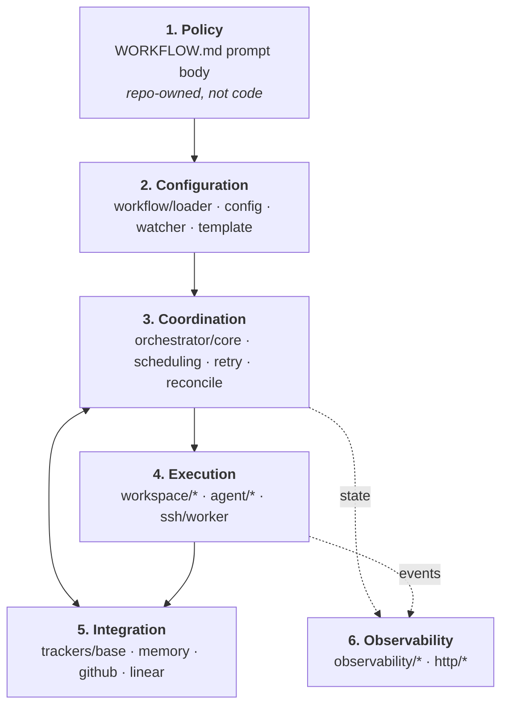
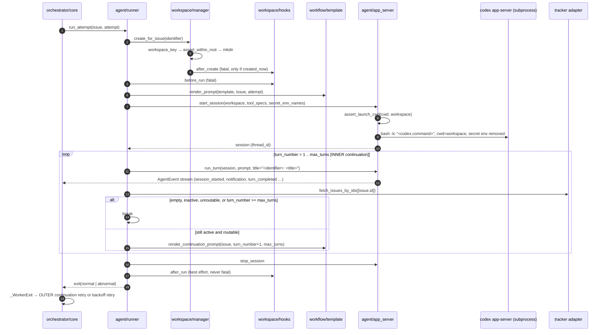

# Architecture

How this implementation is laid out, and how a request actually moves through it.

The organizing map is [SPEC 3.2](../SPEC.md), which names six abstraction levels
and says Symphony "is easiest to port when kept in these layers." So that is the
map used here: a reader who knows the spec should be able to find the code by
layer name. Module ownership is in [`CONTRACTS.md`](../CONTRACTS.md); this
document explains how the owned pieces fit together.

> [!NOTE]
> **Verification basis.** Claims tagged **[verified]** were read against module
> source in the working tree of `D:\symphony-python` on 2026-07-28, at which
> point every path in the `CONTRACTS.md` ownership map existed and
> `pytest` reported **1315 passed, 3 skipped in 111.21s** across 21 test files.
> The three skips are the SPEC 17.8 Real Integration Profile, which requires
> credentials this host does not have. The tree was still being modified while
> this document was written, so a module may have changed after the claim about
> it was recorded.
>
> Claims tagged **[unverified]** could not be checked here — chiefly anything
> requiring a running `codex` binary or a live tracker. §8 lists them, and
> [`CONFORMANCE.md`](CONFORMANCE.md) tracks them per requirement.

---

## 1. Layer map



| # | SPEC 3.2 layer | Modules | Spec sections |
|---|---|---|---|
| 1 | Policy (repo-defined) | `WORKFLOW.md` prompt body; team rules | 5.4, 12 |
| 2 | Configuration (typed getters) | `workflow/loader.py`, `workflow/config.py`, `workflow/watcher.py`, `workflow/template.py` | 5, 6, 12 |
| 3 | Coordination (orchestrator) | `orchestrator/core.py`, `scheduling.py`, `retry.py`, `reconcile.py` | 7, 8, 16 |
| 4 | Execution (workspace + agent subprocess) | `workspace/{manager,safety,hooks}.py`, `agent/{runner,app_server,events,approvals}.py`, `ssh/worker.py` | 9, 10, 16.5, App. A |
| 5 | Integration (tracker adapter) | `trackers/base.py`, `trackers/{memory,github,linear}.py` | 11 |
| 6 | Observability (logs + status) | `observability/{logging,snapshot,status,humanize}.py`, `http/{server,api,dashboard}.py` | 13 |

Three things sit outside the six-layer map and are called out rather than forced
into it:

- **`models.py` and `errors.py`** are the shared vocabulary every layer imports.
  They are not a layer; they are the type system the layers agree on.
- **`cli.py` / `__main__.py`** are the host lifecycle (SPEC 17.7), above the
  layers rather than inside one.
- **`rlm/`** (`introspect.py`, `recursive.py`, `repl.py`) is an addressability
  surface over the running system, not a stage in the data path. It is this
  implementation's own extension, documented in [`RLM.md`](RLM.md).

### 1.1 Policy layer

`WORKFLOW.md` is repository-owned and version-controlled (SPEC 5.1). Its
Markdown body is the per-issue prompt template; its YAML front matter is
everything else. There is no service-side config file — SPEC 5.2's design note
requires the workflow file be self-contained enough to describe and run a
workflow without out-of-band configuration.

The example at the repository root is a real, rendered-in-test artifact:
`tests/test_template.py` renders `./WORKFLOW.md` against both a fully-populated
issue and an issue with every optional field absent. **[verified]**

Policy is *trusted input*. See [`SECURITY.md`](SECURITY.md) for what that costs.

### 1.2 Configuration layer

Four modules, in the order the SPEC 6.1 pipeline runs them.

**`workflow/loader.py`** — path selection and file parsing. **[verified]**
`resolve_workflow_path(explicit)` applies the SPEC 5.1 precedence (explicit
runtime path, else `./WORKFLOW.md`) and is pure: it does not touch the
filesystem, so a nonexistent path resolves fine and fails later at load with a
typed error. `load_workflow(path)` splits front matter from body and returns
`WorkflowDefinition(config, prompt_template, source_path)`. It handles the
awkward parts explicitly — UTF-8 BOM, CRLF, an indented `---` that must *not*
close front matter, a `---` in the body that must survive. Failures are the SPEC
5.5 slugs: `MissingWorkflowFile`, `WorkflowParseError`,
`WorkflowFrontMatterNotAMap`.

**`workflow/config.py`** — the typed view. **[verified]** `build_config(defn)`
produces a frozen `ServiceConfig`, applying SPEC 6.4 defaults and coercions.
Two coercion rules matter and are easy to get wrong:

- `expand_value` applies `~` and `$VAR` expansion **only** to values intended as
  local filesystem paths or an adapter's documented secret keys. `codex.command`
  and every `hooks.*` script are copied through untouched, because SPEC 6.1
  forbids rewriting arbitrary shell command strings. `~` expansion applies to the
  *authored* value only, so a secret whose value starts with `~` is never
  reinterpreted as a home directory. A `$VAR` that is unset **or empty** is
  missing (SPEC 5.3.1) and raises `ConfigValidationError` naming the variable but
  never its value.
- Invalid values split into two classes deliberately. `agent.max_turns` and
  `hooks.timeout_ms` fail validation (SPEC 5.3.4, 5.3.5); an invalid
  `max_concurrent_agents_by_state` entry is *ignored* (SPEC 5.3.5); and
  `codex.stall_timeout_ms <= 0` is *valid* and disables stall detection
  (SPEC 5.3.6) rather than falling back to the default.

`validate_dispatch_config(cfg)` is the SPEC 6.3 preflight — the same function
runs at startup (fatal) and before every dispatch cycle (skip the tick,
reconciliation still happens).

**`workflow/watcher.py`** — dynamic reload (SPEC 6.2). **[verified]** The
contract is narrower than "notice the file changed": an *invalid* reload must
keep the last known good effective configuration and emit an operator-visible
error without crashing. Hence the `ReloadOutcome`/`ReloadStatus` result type and
a `FileStamp` content comparison rather than mtime alone — `test_watcher.py`
covers change detection across an unchanged mtime, and covers `is_stale()` as a
defensive path for missed filesystem events (SPEC 6.2's "re-validate defensively
during runtime operations").

**`workflow/template.py`** — strict prompt rendering (SPEC 5.4, 12).
**[verified]** Liquid semantics with strict variable *and* strict filter
checking; an unknown variable or filter raises `TemplateRenderError`, a malformed
template raises `TemplateParseError`, and an empty body yields the SPEC 5.4
fallback prompt. Rendering is a Configuration-layer *capability* invoked from the
Execution layer (SPEC 3.1 puts prompt building inside the Agent Runner), which is
why it lives here but appears in §3 below.

### 1.3 Coordination layer

This is the only layer permitted to mutate scheduling state (SPEC 7). It is split
so that the *decisions* are pure functions and the *effects* live in one place:

| Module | Owns | Purity |
|---|---|---|
| `scheduling.py` | SPEC 8.2 sort + eligibility, SPEC 8.3 slot arithmetic | pure; no I/O, no awaits, no mutation |
| `retry.py` | SPEC 8.4 backoff arithmetic; the retry-entry/timer map | mutates `state.retry_attempts` only; clock and timer factory injected |
| `reconcile.py` | SPEC 8.5/16.3 branch tables; SPEC 8.6 startup sweep | `plan_*` functions pure; async drivers take effects via `ReconcileDeps` |
| `core.py` | The tick, running map, claims, worker lifecycle, event ingestion (SPEC 7, 8.1, 16.1–16.4, 16.6) | the single mutation authority |

All four **[verified]**. The split is not decoration:
`plan_reconciliation(running_ids, refreshed, cfg)` answers "what would
reconciliation do?" without a tracker, a process, or a filesystem — which is what
makes reconciliation testable and REPL-inspectable.

`Orchestrator` serializes every mutation through a **mailbox loop**: `_Tick`,
`_WorkerExit`, `_RetryFired`, `_AgentUpdate`, `_PhaseUpdate`, `_ApplyConfig`,
`_Invoke`, `_Stop` are commands processed one at a time, which is how SPEC 7.4's
"serializes state mutations through one authority" is realized on asyncio.
`invoke(fn)` runs an arbitrary callable inside that same authority, which is what
lets the RLM surface read consistent state without racing the loop. **[verified]**

Two boundaries inside this layer are load-bearing:

- `issue_routable(issue, cfg)` checks **only** `dispatchable is True` and
  required-label match. It deliberately does *not* check state, claims, or
  concurrency, because reconciliation calls it on already-running issues and the
  retry path calls it on already-claimed issues; folding a claim check into it
  would terminate live work. `should_dispatch` is the full SPEC 8.2 predicate.
- `retry.py` never touches `state.claimed` and never fetches from the tracker.
  Claim acquisition/release lives in the SPEC 16.4/16.6 handlers in `core.py`;
  the queue only delivers the "timer fired" edge.

### 1.4 Execution layer

**`workspace/safety.py`** — SPEC 9.5 Invariants 1 and 2. **[verified]**
`assert_within_root` resolves both operands to absolute, symlink-resolved paths
and compares them as `os.path.normcase`'d *components*, never as strings. That
rejects `/base/root-evil` against `/base/root`, rejects `..` traversal, rejects a
workspace symlinked out of the root, and still accepts legitimate Windows case
and 8.3-short-name variants. Containment is **strict** — the root itself is not
inside the root, closing the case where a degenerate key would make cleanup
delete every workspace. `assert_launch_cwd` enforces `cwd == workspace_path`
immediately before subprocess launch. Invariant 3 (key sanitization) lives in
`models.workspace_key`: characters outside `[A-Za-z0-9._-]` become `_`, and a
64-bit BLAKE2b digest of the *original* identifier is appended **only** when
sanitization changed something, so unchanged identifiers keep a plain
deterministic key while colliding identifiers stay distinct.

**`workspace/manager.py`** — creation, reuse, removal. **[verified]**
`created_now` is decided by a single `mkdir` rather than an `exists()`-then-
`mkdir` pair, so two workers racing on one identifier cannot both run
`after_create`. Documented policy positions are enforced here: a non-directory at
the workspace path fails the attempt and is *never* unlinked; a failed
`after_create` discards the directory *this call* created (SPEC 9.3) so the
once-per-workspace contract stays honest; `cleanup` refuses to follow a symlink
or unlink a non-directory. Blocking filesystem work goes through
`asyncio.to_thread`. The manager owns exactly two hook edges — `after_create` and
`before_remove` — because the other two bracket an *attempt*, not a workspace.

**`workspace/hooks.py`** — `HookRunner.run(name, cwd, *, fatal)`. **[verified]**
`fatal` comes from the caller and is never inferred from the hook name, because
SPEC 9.4's failure-semantics table is a property of the call site. Two
implementation choices are worth knowing before authoring hooks:

- A timeout kills the whole **process tree** (Windows Job Object, POSIX process
  group), not just the shell. `asyncio.wait_for` alone would abandon the
  subprocess, leaving a detached shell holding the workspace open — which SPEC
  15.4's "hook timeouts are REQUIRED to avoid hanging the orchestrator" exists to
  prevent.
- Completion is EOF on the hook's stdout. A hook that backgrounds a process
  without redirecting output (`mydaemon &`) holds the pipe open, is treated as a
  timeout, and is killed. Write `mydaemon >/dev/null 2>&1 &`.
- Shell selection honors SPEC 9.4 (`sh -lc`) on any host with a POSIX shell,
  including Windows via Git Bash/MSYS2/Cygwin. Only when no POSIX shell is on
  `PATH` does it fall back to `%COMSPEC% /d /s /c`, and that fallback is reported
  on `HookShell.kind` and logged on every hook start rather than applied
  silently. Hook output is truncated head-and-tail in logs (SPEC 15.4).

**`agent/app_server.py`** — the Codex app-server subprocess client. Launch is
`bash -lc <codex.command>` with `cwd=workspace` (SPEC 10.1) and
`MAX_LINE_BYTES = 10 * 1024 * 1024` (SPEC 10.1 RECOMMENDED). `argv[0]` is the
PATH-resolved absolute path to `bash`; if no `bash` exists the launch raises
`CodexNotFound` rather than silently substituting another shell. **[verified]**
Every protocol method and field name lives in one `ProtocolNames` dataclass,
which the module's own header marks as **not confirmed against a running `codex`
binary** — only `thread/tokenUsage/updated` appears verbatim in SPEC 13.5; the
rest follow its convention and are best-effort. **[unverified]** See §8.

**`agent/approvals.py`** — the SPEC 10.5 posture as a swappable object.
**[verified]** `TRUSTED_AUTO_APPROVE` (the documented default) approves
command-execution and file-change *for the session*, fails the run on
user-input-required, and denies unclassifiable requests. `DENY_ALL` ships as a
stricter alternative. There is deliberately no `ESCALATE` decision: this
implementation ships no operator channel, and a decision with nowhere to go is
exactly the indefinite stall SPEC 10.5 forbids.

**`agent/events.py`** — normalizes app-server output into `AgentEvent` using the
SPEC 10.4 event names, and owns the SPEC 13.5 token-accounting rule that only
*absolute* totals count (`thread/tokenUsage/updated`, `total_token_usage`) while
delta payloads like `last_token_usage` and generic `usage` maps are ignored.
**[verified]**

**`agent/runner.py`** is SPEC 16.5 — see §3. **[verified]**

**`ssh/worker.py`** is the Appendix A remote-execution profile, documented in
[`ssh-worker.md`](ssh-worker.md).

### 1.5 Integration layer

`trackers/base.py` **[verified]** defines the whole tracker boundary, and it is
deliberately small: two required reads (`fetch_issues_by_states`,
`fetch_issues_by_ids`) plus three optional agent-tool hooks (`agent_tool_specs`,
`secret_environment_names`, `execute_agent_tool`). SPEC 11.5 is explicit that the
orchestrator is a scheduler and tracker *reader*; ticket mutations happen through
provider-native tools executed host-side.

The asymmetry between the two reads is the part implementers get wrong: a
state-list read MAY omit an individually malformed record (it was never safe to
dispatch) and SHOULD log the omission; an ID-refresh MUST *fail* rather than
omit, because omission is meaningful — the orchestrator reads a missing ID as "no
longer visible in scope" and terminates the run.

`build_adapter(kind, provider)` resolves a `@register_adapter`-decorated class
from the registry. Three adapters ship — `memory`, `github`, `linear` — each with
the SPEC 11.2 profile under [`docs/adapters/`](adapters/).

### 1.6 Observability layer

`observability/logging.py` provides `StructuredLogger` with `key=value` rendering
(SPEC 13.1) and `.bind()` for the required `issue_id`, `issue_identifier`, and
`session_id` context. Redaction is **by key name**, not by value shape, because a
value heuristic both misses real secrets and redacts innocent fields; matched
keys render as `[redacted]` (SPEC 15.3). **[verified]**

`snapshot.py` builds the SPEC 13.3/13.7.2 shape from `OrchestratorState`.
`status.py` and `humanize.py` are the optional surfaces of SPEC 13.4/13.6.
`http/` is the SPEC 13.7 extension: dashboard at `/`, JSON API under
`/api/v1/*`, CLI `--port` overriding `server.port`, and `DEFAULT_BIND_HOST =
"127.0.0.1"` (SPEC 13.7's loopback default). The listener does not hot-rebind on
a workflow reload, which SPEC 6.2 explicitly permits for extension-owned
resources. **[verified]**

Everything in this layer is one-directional: it reads orchestrator state and must
not be required for correctness (SPEC 13.4, 13.7). A log sink failure must not
crash orchestration (SPEC 13.2).

---

## 2. Request path: a poll tick, end to end

SPEC 8.1 and 16.2, implemented by `Orchestrator._run_tick`. The tick is the only
scheduled entry point; everything else is an edge delivered *into* the mailbox.

```mermaid
sequenceDiagram
    autonumber
    participant T as tick timer
    participant Core as orchestrator/core
    participant R as reconcile
    participant Cfg as workflow/config
    participant Tr as tracker adapter
    participant S as scheduling
    participant W as worker task
    participant Obs as observability

    T->>Core: _Tick → mailbox
    Core->>R: reconcile_stalled_runs (Part A)
    R-->>Core: StallDecision[] → kill + schedule_failure
    Core->>R: reconcile_running_issues (Part B)
    R->>Tr: fetch_issues_by_ids(running_ids)
    Tr-->>R: refreshed[] (or error → keep workers, return)
    R-->>Core: ReconcileDecision[] → terminate / clean / update
    Core->>Cfg: validate_dispatch_config
    Cfg-->>Core: ok (or error → log, return; tick still reschedules)
    Core->>Tr: fetch_issues_by_states(active_states)
    Tr-->>Core: candidates[] (or error → log, return)
    Core->>S: sort_for_dispatch(candidates)
    loop while available_slots > 0
        Core->>Core: skip if id in running or claimed
        Core->>S: should_dispatch(issue, state, cfg)
        Core->>W: spawn run_attempt(issue, attempt=None)
        Core->>Core: running[id] = entry; claimed.add(id); retry_attempts.pop(id)
    end
    Core->>Obs: notify observers
    Core->>T: arm tick timer (state.poll_interval_ms)
```

Ordering facts that are requirements rather than conveniences, all **[verified]**
in `core.py`:

1. **Reconciliation runs before dispatch, always** (SPEC 7.4, 8.1). If preflight
   validation fails, dispatch is skipped for the tick but reconciliation has
   already happened. A misconfigured workflow therefore still stops runs whose
   issues went terminal.
2. **Stall detection runs before state refresh** (SPEC 8.5 Part A then Part B),
   so a stalled worker is killed on this tick rather than waiting for a tracker
   round trip that may fail.
3. **A failed state refresh produces no decisions at all.** `plan_reconciliation`
   must only be given a *successful* refresh; treating a transient network error
   as an empty result would terminate every live session.
4. **Only a terminal tracker state cleans the workspace.** Unroutable,
   non-active, and no-longer-visible all terminate *without* cleanup, because the
   issue may come back and the workspace is expensive reusable state (SPEC 9.1).
   Terminal is tested first, so a state configured as both active and terminal
   terminates and cleans.
5. **The claim check is enforced twice.** `_run_tick` re-checks `running`/
   `claimed` before calling `should_dispatch`, and `_dispatch_issue` re-checks
   `running` again, so a policy regression in `scheduling.py` cannot produce a
   duplicate worker (SPEC 7.4).
6. **Config is re-read, not cached into state.** `available_slots` reads
   `max_concurrent_agents` from `cfg`, so a reload takes effect on the next
   dispatch decision; the tick re-arms from `state.poll_interval_ms`, which
   `_ApplyConfig` updates (SPEC 6.2).

Three other edges land in the same authority: `_AgentUpdate` (from a live worker,
updating `LiveSession`, token counters, rate limits), `_RetryFired` (SPEC 16.6 —
refresh the one issue, then dispatch, requeue with `no available orchestrator
slots`, or release the claim), and `_WorkerExit`.

---

## 3. Request path: a worker attempt, end to end

SPEC 16.5, implemented by `agent/runner.py`. **[verified]** except where the
Codex protocol itself is involved.



Details worth stating because the spec decides them, not taste:

- **The prompt is rendered inside the worker, after the workspace exists.** A
  template failure is a *run* failure, not a config failure (SPEC 5.5, 12.4) — it
  fails this attempt and the orchestrator decides retry, while a workflow file or
  YAML error blocks *all* new dispatch.
- **`before_run` is fatal, `after_run` is not** (SPEC 9.4). Once `before_run`
  succeeds, every exit path runs `after_run` best-effort and every exit path with
  a live session stops it. A `before_run` *failure* runs no `after_run` — the run
  never began.
- **The subprocess outlives individual turns.** It is stopped only when the
  worker run ends (SPEC 10.3), which is what makes the inner loop cheap and the
  outer loop expensive.
- **Three timeouts, three owners** (SPEC 10.6): `read_timeout_ms` on
  request/response inside the client; `turn_timeout_ms` as a *silence* interval
  reset by each app-server output, not a total runtime cap; `stall_timeout_ms`
  enforced by the **orchestrator** from event inactivity, not by the worker.
- **Events flow to the orchestrator, not through the runner's return value.** The
  runner reports only exit normality; live session detail arrives as the
  `_AgentUpdate` edge.

---

## 4. The two continuation mechanisms

These are distinct and nested, and readers routinely collapse them into one.
SPEC 7.1's "Important nuance" describes the inner one; SPEC 7.3 *Worker Exit
(normal)* and 16.6 describe the outer one. **Both exist. Neither replaces the
other.**

```
outer: orchestrator, post-exit continuation retry (SPEC 7.3, 16.6)
┌───────────────────────────────────────────────────────────────────┐
│  dispatch → worker task                                           │
│  ┌─────────────────────────────────────────────────────────────┐  │
│  │ inner: in-worker turn loop (SPEC 7.1, 16.5)                 │  │
│  │   turn 1 (full prompt) → turn 2 (guidance) → … ≤ max_turns  │  │
│  │   one app-server subprocess, one thread_id, one workspace   │  │
│  └─────────────────────────────────────────────────────────────┘  │
│  worker exits normally                                            │
│  → schedule_continuation(attempt=1, delay=1000 ms)                │
│  → timer fires → refresh issue → dispatch a NEW worker, or release│
└───────────────────────────────────────────────────────────────────┘
```

| | **Inner: in-worker turn loop** | **Outer: post-exit continuation retry** |
|---|---|---|
| Spec | 7.1 nuance, 10.3, 16.5 | 7.3 *Worker Exit (normal)*, 8.4, 16.6 |
| Lives in | `agent/runner.py` | `orchestrator/core.py` + `orchestrator/retry.py` |
| Trigger | a turn completed successfully and the refreshed issue is still active and routable | the worker task exited *normally* |
| Bound | `agent.max_turns` (default 20) | none; ends when the tracker stops saying "active and routable" |
| Delay | none — next turn starts immediately | `CONTINUATION_DELAY_MS = 1000` |
| App-server subprocess | **same**, kept alive across turns | **new** — the old one was stopped at worker exit |
| `thread_id` | **same**; continuation turns append to existing thread history | **new** thread, new session |
| Workspace | same | same (workspaces are reused, never auto-deleted) |
| Claim state (SPEC 7.1) | stays `Running` | `Running` → `RetryQueued` → `Running` or `Released` |
| Prompt sent | `render_continuation_prompt(issue, turn_number, max_turns)` — guidance only, **never** the original task prompt, which is already in thread history | `render_prompt(template, issue, attempt)` — the full task prompt again, into a fresh thread |
| Counter surfaced to the template | none; `turn_number` never reaches the workflow template | `attempt`, the 1-based SPEC 12.3 value |
| Hooks | `before_run`/`after_run` run **once per worker**, not per turn | a new worker means a new `before_run`/`after_run` pair |

Consequences an operator should know:

1. **`{{ attempt }}` in `WORKFLOW.md` is the outer counter.** It counts worker
   dispatches, not agent turns, and SPEC 12.3 says it does *not* distinguish a
   clean continuation from an error retry. SPEC 12.3 permits an extra
   `retry_kind` field for workflows that need the distinction but excludes it
   from core conformance; this implementation does not ship one.
2. **The outer loop is why a clean exit is not "done".** SPEC 7.1: "A successful
   worker exit does not mean the issue is done forever." An issue left in an
   active state is picked back up about a second later, with a fresh context
   window. Workflow-defined success is normally "reached the next handoff state"
   (SPEC 11.5), and the way to stop the loop is a tracker state transition — not
   an agent deciding it is finished. An issue that never leaves an active state
   is worked continuously; see [`SECURITY.md`](SECURITY.md) for the cost.
3. **Failure retries share the outer path but not its delay.** `retry.py` keeps
   the regimes on separate named code paths: `schedule_continuation` (fixed
   1000 ms, attempt 1, no error) versus `schedule_failure`
   (`min(10000 · 2^(attempt−1), agent.max_retry_backoff_ms)`, carrying the error
   string). Attempt 1 waits exactly 10 s, not 20 s.
4. **A retry timer is replaced, never duplicated.** Creating an entry cancels any
   existing timer for the same issue, and a generation counter makes an
   already-queued callback inert if it fires after cancellation — a leaked timer
   would re-dispatch a claimed issue, the exact double dispatch claims exist to
   prevent.

---

## 5. State, authority, and concurrency

- **One mutation authority.** SPEC 7.4 requires serialized state mutation.
  `OrchestratorState` is mutated only inside the `Orchestrator` mailbox loop; the
  pure modules compute decisions and the core applies them. `retry.py` is the one
  narrow exception — it owns `state.retry_attempts` and its timers, and
  deliberately does not touch `state.claimed`.
- **`claimed` is the anti-double-dispatch primitive.** `should_dispatch` rejects
  anything in `running` *or* `claimed`, and a retry-queued issue is still
  claimed, so a pending retry cannot also be dispatched by a poll tick.
- **Single event loop.** Everything is `asyncio`; blocking filesystem work goes
  through `asyncio.to_thread`. Workers are tasks, not threads or processes — the
  *coding agent* is the subprocess.
- **Injected clocks and timers.** `retry.py` takes `clock` and `timer_factory`;
  `core.py` takes a `Clock` protocol (`now`, `monotonic_ms`, `call_later_ms`);
  `reconcile.py` takes `now()` through `ReconcileDeps`. `RetryEntry.due_at_ms` is
  a monotonic reading. Retry and reconciliation behavior is therefore tested
  without wall-clock sleeps (CONTRACTS house rule 8).
- **No durable scheduler state.** SPEC 14.3 is explicit that this is intentional.
  After a restart: no retry timers are restored, no running session is assumed
  recoverable, and recovery is startup terminal cleanup + a fresh poll +
  re-dispatch. Workspaces persist and are reused; that is the only state that
  crosses a restart.

## 6. Failure model

SPEC 14.2, and the reason the layers are separated the way they are:

| Failure | Blast radius |
|---|---|
| Workflow file / YAML error | Blocks **all new dispatch** until fixed; service stays alive on last known good config; reconciliation continues (SPEC 5.5, 6.2) |
| Template render error | Fails **one attempt**; orchestrator retries (SPEC 5.5, 12.4) |
| Workspace or hook failure | Fails **one attempt** (`after_create`/`before_run`); `after_run`/`before_remove` failures are logged and ignored (SPEC 9.4) |
| Agent session failure, turn failure/timeout, stall | Fails **one attempt** → exponential backoff retry (SPEC 8.4, 14.2) |
| Candidate fetch failure | Skips **one tick** (SPEC 11.4) |
| Running-state refresh failure | **Nothing terminates**; workers keep running, retried next tick (SPEC 8.5, 11.4) |
| Startup terminal cleanup failure | Warning; startup continues (SPEC 8.6) |
| Log sink / dashboard failure | Must not crash orchestration (SPEC 13.2, 14.2) |

## 7. Extension points

| Extension | Spec | Location | Documented in |
|---|---|---|---|
| HTTP dashboard + JSON API | 13.7, 18.2 | `http/` | §1.6 above |
| SSH remote workers | Appendix A | `ssh/worker.py` | [`ssh-worker.md`](ssh-worker.md) |
| Provider-native agent tools | 10.5, 11.5, 18.2 | adapter `agent_tool_specs`/`execute_agent_tool` | [`adapters/`](adapters/) |
| Tracker adapters | 11 | `trackers/{memory,github,linear}.py` | [`adapters/`](adapters/) |
| RLM addressability surface | — (this implementation's own) | `rlm/` | [`RLM.md`](RLM.md) |

Extension config keys (`server.*`, `worker.*`) are carried on `ServiceConfig`
(`server_port`, `ssh_hosts`, `max_concurrent_agents_per_host`), so core
conformance does not depend on the extensions shipping.

## 8. What this document does not establish

Recorded plainly, because a reader should know the edge of the evidence:

1. **The Codex app-server wire protocol is unverified.** `ProtocolNames` in
   `agent/app_server.py` carries the method and field strings — `initialize`,
   `thread/start`, `thread/sendMessage`, `thread/execCommandApproval`,
   `thread/applyPatchApproval`, and the rest. Only `thread/tokenUsage/updated`
   appears verbatim in SPEC 13.5; the others were written to that convention and
   **were not confirmed against a running `codex` binary**, which is not
   installed on this host. If they are wrong, session startup fails at runtime
   even though every test passes, because the tests exercise the client against a
   scripted stdio peer rather than Codex. The correction path is contained: run
   `codex app-server generate-json-schema`, diff, and edit that one dataclass.
2. **No real integration run happened.** The three skipped tests are the SPEC
   17.8 profile (`SYMPHONY_TEST_SSH_HOST`, `SYMPHONY_GH_OWNER`/
   `SYMPHONY_GH_PROJECT`, `LINEAR_API_KEY`/`LINEAR_TEAM_KEY`). No claim in this
   document about GitHub Projects v2 or Linear behavior has been observed against
   a live API.
3. **The evidence for [verified] claims is source text, at varying depth.**
   `safety.py`, `manager.py`, `scheduling.py`, and `retry.py` were read in full.
   For `core.py`, `runner.py`, `app_server.py`, `hooks.py`, `events.py`,
   `logging.py`, `http/server.py`, and the three adapters, the *specific* claims
   above were located in source; those modules were not read end to end. Claims
   resting on a module docstring rather than an executed path are marked as such
   in the text where it matters.
4. **Per-requirement status lives in [`CONFORMANCE.md`](CONFORMANCE.md);**
   security posture and its costs live in [`SECURITY.md`](SECURITY.md). This
   document describes shape, not conformance.
